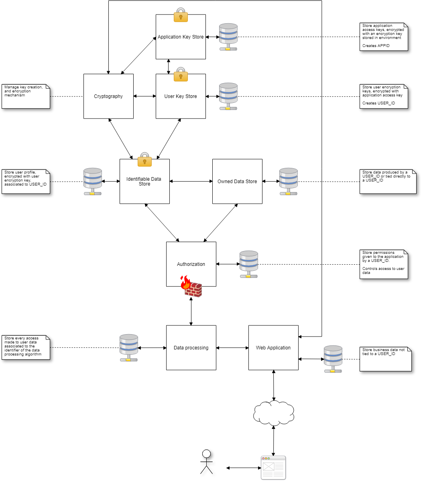

Secure User Data
================

**WORK IN PROGRESS**

Infrastructure to store, manage and access user data in a very secure manner.

License
-------

This project is released under the *Apache Public License 2*.

Why ?
-----

We live in a world where we provide our identifiable data (name, email, address, age, ...) to many services like Google, Facebook, Twitter, ...
We have no guarantee on how those data are stored, how they are used. We lost control of our data. Yes **our data**.
New laws are emerging to enforce those guarantees, like the `GDPR <https://www.eugdpr.org>`_ in Europe.

Data privacy is a main concern now, as it should have been since the beginning.

This project aims to help to comply to those laws.

**NB: I am not a security expert nor a legal expert, and I would be glad to receive comments, advices, or help on this project.**

Introduction
------------

This project provides the following services:

 - **cryptography**: handles key creation/rotation and encryption
 - **app-key-store**: manage encryption keys for applications, stored in a MongoDB database, encrypted with a key stored in an environment variable
 - **user-key-store**: manage encryption keys for users, stored in a MongoDB database, encrypted with an application key
 - **identifiable-data-store**: manage identifiable user data (name, address, birthday, ...), stored in a MongoDB database, encrypted with a user key
 - **owned-data-store**: manage data owned by a user (ie. private messages, posts on a forum, ...), stored in a MongoDB database
 - **authorization-firewall**: manage access authorization to user data, store authorization per user in a MongoDB database, act as a firewall to the **identifiable-data-store** and the **owned-data-store**
 - **data-processing**: manage all user data consumers and track their use, talks with the **authorization-firewall**, store access to user data in a MongoDB database

This architecture aims to provide:

 - full security on user data storage (identifiable data are encrypted with a key specific to a user, the user key is encrypted with a key specific to the application)
 - full control on user data usage (the user can allow/forbid the consuption of its data for every data processing script registered in the **data-processing** service)
 - full tracability on user data usage
 - the possibility to export/delete all user data in a single request

The service **cryptography** also provides the ability to change a key and re-encrypt data with the new key.

Schema
------

Usage
-----

Using the service **app-key-store**, you register a new application and receive an application id.

Using the service **identifiable-data-store**, you create a user profile and receive a user id. You **MUST** store all identifiable data into this service.

Using the service **owned-data-store**, you store all data related to a user.

Using the service **data-processing**, you register all your scripts using user data, it will automatically give the user the ability to accept or deny the usage of its data by this script.

Status
------

This project is in a very early stage of development, the provided services may change, the API may change, everything may change.

**This is definitely not ready for production !**
